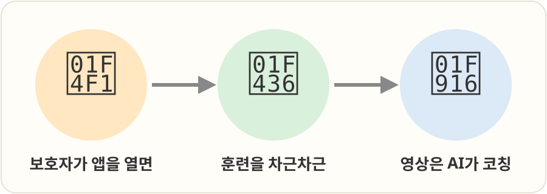
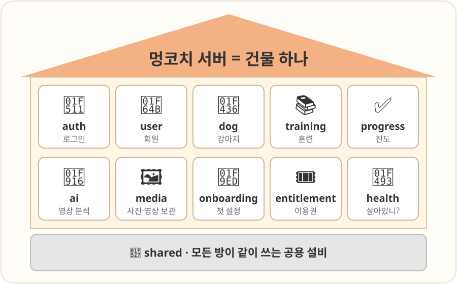
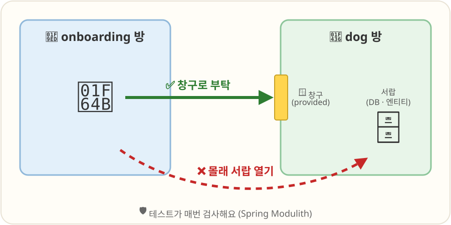
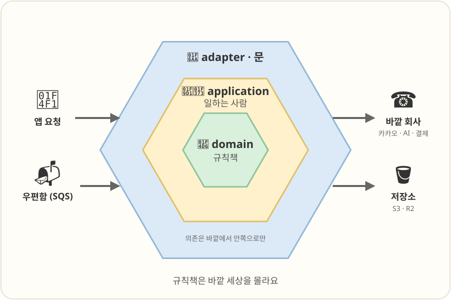
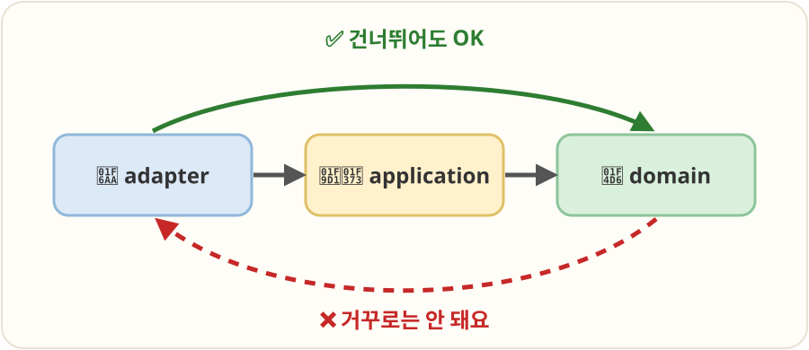
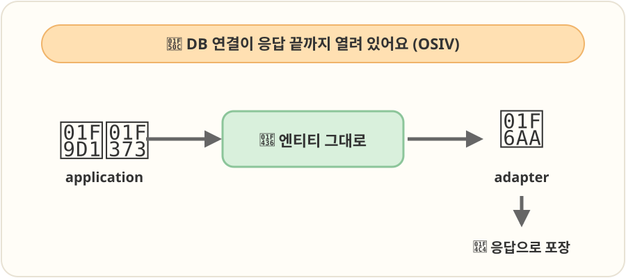
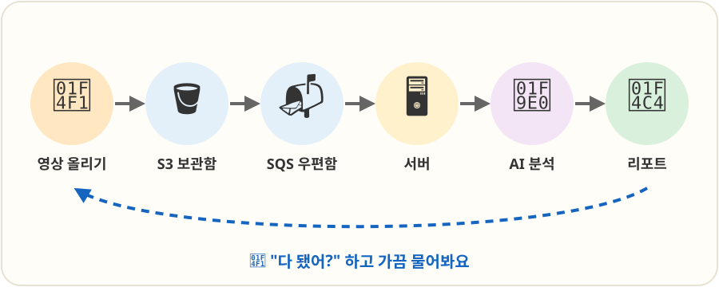
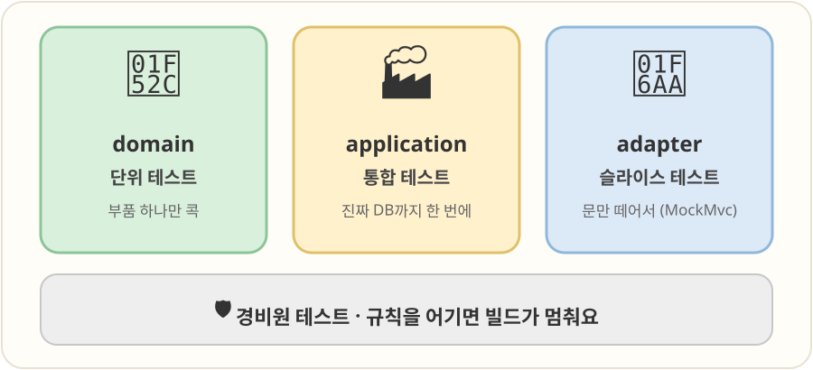

# 🐶 멍코치 서버, 그림으로 보기

> 그림만 따라 내려가면 됩니다. 자세한 글 버전은 [README.md](README.md)에 있어요.

## 1. 멍코치는 뭐 하는 앱이에요?

보호자와 강아지의 훈련을 도와주는 앱이에요. 이 저장소는 그 앱 뒤에서 일하는 **서버**예요.

## 2. 서버는 건물 하나, 방이 여러 개

건물(서버)은 하나예요. 일은 **방(모듈)** 마다 따로 해요.
나중에 방 하나를 떼어 다른 건물로 옮길 수도 있어요.

## 3. 다른 방에는 창구로만 부탁해요

남의 방 서랍은 열지 않아요. 방마다 있는 **창구(`provided`)** 로만 부탁해요.
규칙을 어기면 테스트가 바로 알려줘요.

## 4. 방 하나를 열어 보면

- 🚪 **문(adapter)**: 앱 요청이나 우편함 편지를 받고, 바깥 회사에 전화를 걸어요.
- 🧑‍🍳 **일하는 사람(application)**: 규칙책을 보며 일을 처리해요.
- 📖 **규칙책(domain)**: 강아지는 5마리까지 같은 규칙이 적혀 있어요.

바깥 회사가 바뀌어도 규칙책은 그대로예요.

## 5. 계단은 건너뛰어도 돼요

안쪽으로 가는 방향만 지키면 중간 계단은 건너뛰어도 돼요. 거꾸로 올라가는 건 안 돼요.

## 6. 강아지 정보를 그대로 들고 나가요

DB 연결이 응답이 끝날 때까지 열려 있어요(OSIV).
그래서 강아지 정보(엔티티)를 옮겨 담지 않고 문까지 그대로 들고 가서, 문 앞에서 응답으로 포장해요.

## 7. 누가 누구에게 부탁하나요?

코드를 보고 컴퓨터가 직접 그린 지도예요.
네모는 방, 구름은 바깥 회사, 화살표는 "부탁하는 방향"이에요.

## 8. 영상을 올리면 무슨 일이 생기나요?

AI 분석은 오래 걸려요. 그래서 우편함(SQS)에 넣어 두고 차례대로 처리해요.
앱은 기다리면서 "다 됐어?" 하고 가끔 물어봐요.

## 9. 시험은 세 종류

- 🔬 규칙책은 하나씩 꼼꼼히 봐요.
- 🏭 일하는 사람은 진짜 DB와 함께 처음부터 끝까지 봐요.
- 🚪 문은 문만 떼어서 봐요.
- 🛡️ 방 규칙을 어기면 경비원 테스트가 빌드를 멈춰요.
