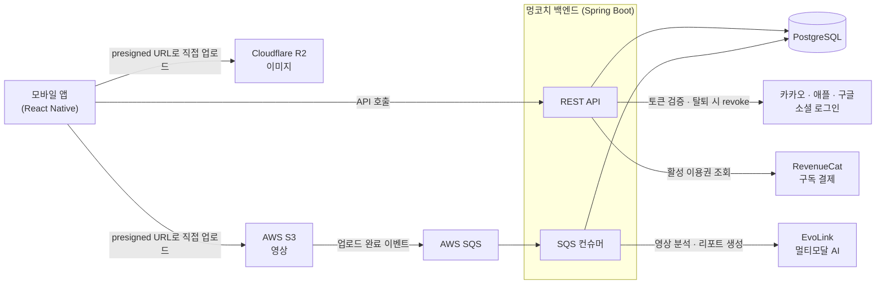
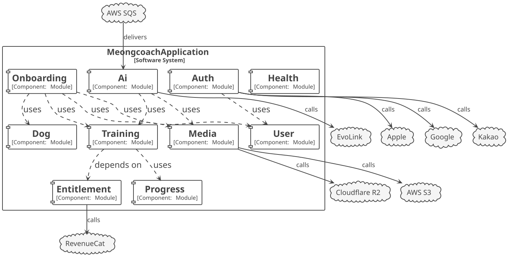

# 멍코치 Back-End

멍코치는 보호자가 반려견 훈련을 단계별로 따라 할 수 있도록 돕는 모바일 앱입니다. 이 저장소는 React Native 앱이 호출하는 백엔드 API 서버이며, 소프트웨어 마에스트로 과정에서 팀원 3명이 개발하고 있습니다.

이 문서는 프로젝트를 처음 보는 분이 **구조와 설계 판단의 근거**를 빠르게 파악할 수 있도록 정리했습니다. 세부 규칙은 문서 끝의 [더 읽을거리](#더-읽을거리)에 있습니다.

## 프로젝트 소개

| 기능 | 설명 |
|---|---|
| 로그인 | 카카오·애플·구글 소셜 로그인. 제공자 토큰을 서버가 검증한 뒤 자체 JWT(액세스·리프레시)를 발급합니다 |
| 온보딩 | 보호자 프로필과 반려견 프로필(견종·성격 등)을 한 번에 등록합니다 |
| 훈련 | 카테고리 → 토픽 → 커리큘럼 → 레슨 → 카드로 이어지는 훈련 콘텐츠를 제공하고 학습 진도를 기록합니다 |
| AI 행동 분석 | 보호자가 올린 반려견 영상을 AI가 분석해 문제 행동 리포트와 추천 훈련을 돌려줍니다 |
| 구독 | 결제는 RevenueCat이 처리하고, 서버는 활성 이용권 사본을 동기화해 유료 콘텐츠 접근을 판단합니다 |

**기술 스택**: Java 25, Spring Boot 4.1, Spring Data JPA, PostgreSQL, Flyway, Spring Modulith 2.1, Spring Cloud AWS(SQS), JUnit 5, Testcontainers, ArchUnit, Spring REST Docs

## 시스템 구성

백엔드는 단일 배포 단위(모놀리스)이고, 외부 시스템과는 아래처럼 연결됩니다. 이미지와 영상은 서버를 거치지 않고, 앱이 서버에서 발급받은 presigned URL로 스토리지에 직접 업로드합니다.



AI 분석은 수십 초가 걸리므로 요청-응답이 아니라 S3 업로드 이벤트를 SQS로 받아 비동기로 처리합니다. 앱은 리포트 목록을 폴링해 결과를 확인합니다. 흐름과 실패 처리는 [docs/ai-pipeline.md](docs/ai-pipeline.md)에 있습니다.

## 아키텍처

### 모듈러 모놀리스 (Spring Modulith)

팀 규모와 MVP 일정을 고려해 배포는 하나로 하되, 코드는 도메인 단위 모듈로 나눴습니다. **최상위 패키지 하나가 모듈 하나이고, 나중에 MSA로 떼어낼 수 있는 단위**입니다. 모듈 경계는 문서로만 두지 않고 Spring Modulith의 `ApplicationModules.verify()`가 테스트로 강제합니다.

- **모듈 간 호출은 각 모듈의 `application/provided` 인터페이스로만 합니다.** 다른 모듈의 서비스 구현체, 리포지토리, 엔티티에는 접근할 수 없습니다.
- **모듈 간 의존은 단방향이고, 다른 모듈의 엔티티는 연관 대신 ID로 참조합니다.** 예를 들어 `auth`는 `user`를 참조하지만 그 반대는 없습니다. 양쪽에 걸친 흐름(회원 탈퇴)은 참조하는 쪽인 `auth`가 조율합니다.
- **경계를 넘는 값은 두 가지뿐입니다.** enum·값 객체 같은 도메인 타입은 `domain/shared` 패키지로 노출해 그대로 주고받고(예: `Breed`, `EntitlementType`), 여러 애그리거트를 조합하거나 일부만 내리는 값만 `~Result` record로 만듭니다. 엔티티는 경계를 넘지 않습니다.

### 모듈 내부 구조 (헥사고날 아키텍처)

각 모듈 안은 `adapter / application / domain` 세 계층이며, 헥사고날 아키텍처의 포트와 어댑터에 다음처럼 대응합니다.

```
{모듈}
├── adapter
│   ├── webapi/        ← 주도(driving) 어댑터: REST 컨트롤러
│   ├── consumer/      ← 주도 어댑터: 메시지 큐 컨슈머
│   ├── security/      ← Spring Security 연동 지점
│   └── integration/   ← 피동(driven) 어댑터: 외부 API 호출 구현
├── application
│   ├── provided/      ← 인바운드 포트: 모듈이 공개하는 유스케이스 인터페이스
│   ├── required/      ← 아웃바운드 포트: 리포지토리 · 외부 API 인터페이스
│   └── ~Service       ← 유스케이스 구현
└── domain             ← 엔티티 · 일급 컬렉션 · 값 객체 · 도메인 예외
```

- 컨트롤러는 `provided` 인터페이스만 알고, 서비스는 외부 자원을 `required` 인터페이스로만 씁니다. 그래서 외부 연동(예: `SocialProfileReader`)을 바꿔도 유스케이스 코드는 그대로입니다.
- 실용적인 타협이 두 가지 있습니다.
  - **리포지토리 포트는 Spring Data JPA가 직접 구현합니다.** `required/UserRepository` 같은 인터페이스가 곧 Spring Data 리포지토리이며, 별도 영속성 어댑터 클래스는 두지 않습니다.
  - **다른 모듈의 기능은 그 모듈의 `provided` 인터페이스를 직접 주입받아 씁니다.** 호출하는 모듈 쪽에 `required` 포트와 어댑터를 따로 두지 않습니다. 모듈 간 결합은 `provided` 인터페이스로 좁혀 두고, 분리가 필요해지는 시점에 해당 호출부만 원격 호출 어댑터로 바꾸는 것을 전제로 합니다.
- 모듈은 필요한 계층만 갖습니다. 다른 모듈의 기능을 조합만 하는 `onboarding`에는 `domain`이 없고, 다른 모듈에서만 호출하는 `progress`·`media`에는 웹 API가 없습니다.

### 완화된 계층형 아키텍처

계층 규칙은 **의존 방향만 지키면 중간 계층을 건너뛰어도 되는 완화된 계층형(relaxed layered) 아키텍처**로 팀이 합의했습니다. 의존은 항상 `adapter → application → domain` 방향이어야 하지만, `adapter`가 `application`을 거치지 않고 `domain` 타입을 직접 참조하는 것은 허용합니다. ArchUnit 테스트(`LayerDependencyTest`)도 역방향 의존만 막고 건너뛰기는 막지 않습니다.

이 합의에는 **OSIV(Open Session In View)를 켠 결정**(`spring.jpa.open-in-view: true`)이 짝을 이룹니다.

- **서비스는 엔티티를 그대로 반환하고, 컨트롤러가 엔티티로 응답 DTO를 조립합니다.** 엔티티를 응답 본문으로 직접 내보내지는 않고, `adapter/webapi/dto`의 `~Response.from(엔티티)`가 도메인 메서드로 응답을 만듭니다. 예를 들어 `DogController`는 `DogProfileFinder`에서 받은 `Dog` 엔티티를 `DogResponse.from(dog)`로 감싸고, 나이는 `dog.getAge()`가 계산합니다.
- 덕분에 값을 옮겨 담기만 하는 중간 DTO(`~Result`)를 만들지 않아도 되고, 서비스는 유스케이스에만 집중합니다.
- 주의할 점도 있습니다. OSIV에서는 컨트롤러가 읽는 지연 로딩 연관이 트랜잭션 밖에서 조회되고, DB 커넥션을 요청이 끝날 때까지 잡습니다. 그래서 컬렉션을 응답에 내려야 하는 조회는 리포지토리에 `@EntityGraph`를 붙여 트랜잭션 안에서 미리 불러옵니다(예: `DogRepository`, `TrainingCategoryRepository`). 외부 API 호출은 첫 DB 접근보다 앞에 두어 커넥션을 오래 잡지 않게 합니다.
- 이 완화는 모듈 안에서만 적용됩니다. 모듈 사이에서는 위의 경계 규칙대로 엔티티를 넘기지 않습니다.

## 모듈 구조

아래 다이어그램은 테스트(`ModularityTest`)가 실행될 때 Spring Modulith `Documenter`가 코드에서 자동 생성한 모듈 의존 관계입니다. `uses`는 다른 모듈의 Spring 빈(`provided` 인터페이스) 호출, `depends on`은 타입 참조입니다. 모든 모듈이 참조하는 `shared`는 관계선이 모듈 수만큼 늘어나 실제 협력 관계를 가리므로 그림에서 뺐습니다.



> 자동 생성 다이어그램은 모듈 사이 관계만 그리고 외부 시스템은 나타내지 않습니다. 외부 시스템은 [시스템 구성](#시스템-구성)에서 볼 수 있습니다. 이 이미지는 생성물을 렌더링한 스냅샷이며, 다시 만드는 방법은 [docs/architecture.md](docs/architecture.md#모듈-경계-검증)에 있습니다.

### 모듈별 책임 · 역할 · 협력

각 모듈이 무엇을 책임지는지, 다른 모듈에 어떤 역할(`provided` 인터페이스)을 공개하는지, 누구와 어떻게 협력하는지 정리했습니다.

#### auth — 인증

- **책임**: 소셜·이메일 로그인, JWT 발급과 검증, 리프레시 토큰 저장·재발급(rotation)·폐기, 로그인 수단(소셜 계정·이메일 계정) 관리
- **역할**: `Authenticator`(로그인·로그아웃·재발급·탈퇴), `AuthTokenProvider`, `AccountFinder`·`AccountRegister`, `RefreshTokenFinder`·`RefreshTokenRegister`
- **협력**: 로그인 시 `user`에 회원을 등록하고, 액세스 토큰 인증 경로에서 `user`의 `RegisteredUserChecker`로 회원 존재와 권한을 확인합니다. 탈퇴할 때는 자기 자격증명과 토큰을 정리한 뒤 `user`에 탈퇴를 요청합니다. 외부로는 카카오·애플·구글과 연동합니다.

#### user — 회원

- **책임**: 회원의 역할(온보딩 중인 회원 → 온보딩을 마친 회원)·상태(활성·탈퇴)와 보호자 프로필
- **역할**: `UserRegister`(가입·탈퇴), `UserFinder`, `UserProfileRegister`, `RegisteredUserChecker`, `MbtiFinder`
- **협력**: 다른 모듈을 호출하지 않습니다. `auth`와 `onboarding`이 `user`를 사용합니다.

#### dog — 반려견

- **책임**: 반려견 프로필 등록·조회·수정·삭제(소프트 딜리트)와 마리 수 상한(5마리), 마지막 한 마리 삭제 금지 같은 사용자 단위 규칙(일급 컬렉션 `Dogs`)
- **역할**: `DogRegister`, `DogProfileFinder`, `DogProfileUpdater`, `DogProfileDeleter`, `BreedFinder`, `PersonalityFinder`. 견종(`Breed`)·성격(`Personality`)은 `domain/shared`로 노출합니다.
- **협력**: 다른 모듈을 호출하지 않습니다. `onboarding`이 반려견 등록과 견종·성격 목록 조회에 사용합니다.

#### training — 훈련 콘텐츠

- **책임**: 카테고리·토픽·커리큘럼·레슨·카드로 구성된 훈련 카탈로그와 사용자의 토픽 선택
- **역할**: `TrainingCategoryFinder`, `TopicFinder`, `TopicSelector`, `CurriculumFinder`, `LessonFinder`, `LessonCompleter`
- **협력**: 학습 기록은 직접 갖지 않고 `progress`에 맡깁니다. 커리큘럼을 조회할 때 `progress`에서 완료한 레슨과 마지막 진입 토픽을 받아 함께 내려주고, 레슨을 완료하면 `progress`에 기록합니다. 카테고리는 열람에 필요한 이용권 종류를 `entitlement`의 `EntitlementType`으로 표현합니다.

#### progress — 학습 진도

- **책임**: 레슨 완료 횟수와 사용자가 마지막으로 진입한 토픽 기록
- **역할**: `LessonProgressFinder`·`LessonProgressUpdater`, `TopicProgressFinder`·`TopicProgressUpdater`. 시그니처에는 JDK 타입만 씁니다.
- **협력**: `training`만 사용하며, 웹 API 없이 `provided` 인터페이스로만 동작합니다.

#### ai — AI 행동 분석

- **책임**: 영상 업로드 URL 발급과 리포트 생성, 비동기 분석 파이프라인, 리포트 상태(업로드 중·분석 중·완료·실패) 관리, 무료 체험 횟수 제한
- **역할**: `AiVideoUploadUrlIssuer`, `AiReportGenerator`, `AiReportFinder`, `AiTrialFinder`
- **협력**: 업로드·다운로드 presigned URL은 `media`에 요청합니다. 분석할 때는 `training`의 `TopicFinder`로 토픽 목록을 받아 AI가 추천할 수 있는 훈련 후보로 넘깁니다. 외부로는 SQS에서 업로드 이벤트를 받고(`VideoUploadSqsConsumer`), EvoLink로 영상 분석과 제목 생성을 요청합니다.

#### media — 파일 저장소

- **책임**: 이미지(R2)·영상(S3) presigned URL 발급, 객체 키 규칙과 소유권, 클라이언트가 보낸 이미지 URL이 우리 저장소 것인지 검증
- **역할**: `ImageUploadUrlIssuer`, `VideoUploadUrlIssuer`, `VideoDownloadUrlIssuer`, `StoredImageUrlValidator`
- **협력**: 다른 모듈을 호출하지 않고, `ai`·`onboarding`이 사용합니다. 저장소의 세부 사항을 이 모듈 안에 가둬 다른 모듈은 파일 업로드를 신경 쓰지 않습니다.

#### onboarding — 온보딩 조합

- **책임**: 온보딩 화면에 필요한 데이터를 모으고, 보호자 프로필과 반려견 등록을 하나의 트랜잭션으로 완료
- **역할**: `OnboardingMetadataFinder`, `OnboardingCompleter`, `OnboardingImageUploadUrlIssuer`
- **협력**: 자체 도메인 없이 `user`(프로필·MBTI 목록), `dog`(반려견 등록·견종·성격 목록), `training`(토픽 목록), `media`(프로필 이미지 업로드·검증)를 조합합니다. 여러 모듈에 걸친 화면 흐름을 한 곳에 모아, 각 도메인 모듈이 서로를 알지 않아도 되게 합니다.

#### entitlement — 이용권

- **책임**: RevenueCat에 기록된 활성 이용권의 사본을 보관하고 동기화(회수·복구·신규 부여)
- **역할**: `EntitlementSynchronizer`. 이용권 종류(`EntitlementType`)는 `domain/shared`로 노출해 여러 모듈이 같은 어휘를 씁니다.
- **협력**: 앱이 결제 후 동기화를 요청하면 RevenueCat에서 활성 이용권을 조회해 맞춥니다. `training`이 이용권 종류 타입을 참조합니다.

#### health — 상태 확인

- **책임**: 배포·모니터링용 헬스 체크 API(`/api/health`). 다른 모듈과 관계가 없습니다.

#### shared — 횡단 관심사

- **책임**: 보안 필터 체인과 JWT 설정, 로그인 사용자 식별(`@CurrentUserId`), 최소 앱 버전 확인, 전역 예외 처리(RFC 9457 Problem Details), 공통 엔티티 기반 클래스와 `DomainException`·`ErrorCode`
- **협력**: 모든 모듈이 `shared`를 참조할 수 있지만 `shared`는 어떤 모듈도 참조하지 않습니다.

## 테스트 전략

계층마다 검증하는 대상이 다르므로 테스트 종류도 계층별로 나눴습니다.

| 계층 | 테스트 종류 | 방식 |
|---|---|---|
| `domain` | 단위 테스트 | Spring 없이 순수 Java로 엔티티·일급 컬렉션·값 객체의 규칙을 검증합니다. (예: `DogsTest`) |
| `application` | 통합 테스트 | `@ApplicationTest`(`@SpringBootTest` + `@Transactional`)로 `provided` 인터페이스부터 서비스·도메인·DB까지 관통해 검증합니다. DB는 Testcontainers가 띄운 실제 PostgreSQL을 쓰고, 외부 연동 포트(RevenueCat 등)만 목으로 바꿉니다. 각 테스트는 끝나면 롤백됩니다. |
| `adapter` | 슬라이스 테스트 | 컨트롤러는 `@WebMvcTest` + MockMvc로 웹 계층만 띄워 요청·응답 형식을 검증합니다. 이 테스트가 Spring REST Docs 스니펫을 만들고, 스니펫으로 API 문서와 OpenAPI(Swagger UI) 스펙을 생성합니다. 외부 API 연동 어댑터는 `MockRestServiceServer`로 검증합니다. |

이에 더해 아키텍처 규칙도 테스트로 강제합니다.

- `ModularityTest`: Spring Modulith로 모듈 경계 위반을 검증하고, 모듈 다이어그램·캔버스 문서를 생성합니다.
- `LayerDependencyTest` 등 ArchUnit 테스트: 계층 의존 방향, 모듈 간 순환 의존, 역할별 네이밍, 도메인 계층의 Spring 비의존을 검증합니다.
- CI에서 JaCoCo 라인 커버리지 70% 미만이면 빌드가 실패합니다.

## 더 읽을거리

| 문서 | 내용 |
|---|---|
| [docs/architecture.md](docs/architecture.md) | 모듈 규칙, 계층 의존 방향, 모듈 경계 검증 |
| [docs/ai-pipeline.md](docs/ai-pipeline.md) | 영상 업로드 → SQS → AI 분석 → 리포트 저장 비동기 흐름과 실패 처리 |
| [docs/security.md](docs/security.md) | JWT 토큰 정책과 검증 체인, 필터 체인 |
| [docs/error-handling.md](docs/error-handling.md) | Problem Details 에러 응답 형식 |
| [docs/media.md](docs/media.md) | presigned URL 발급과 객체 키 소유권 규칙 |
| [AGENTS.md](AGENTS.md) | 팀 개발 규칙 전체 목록 |
