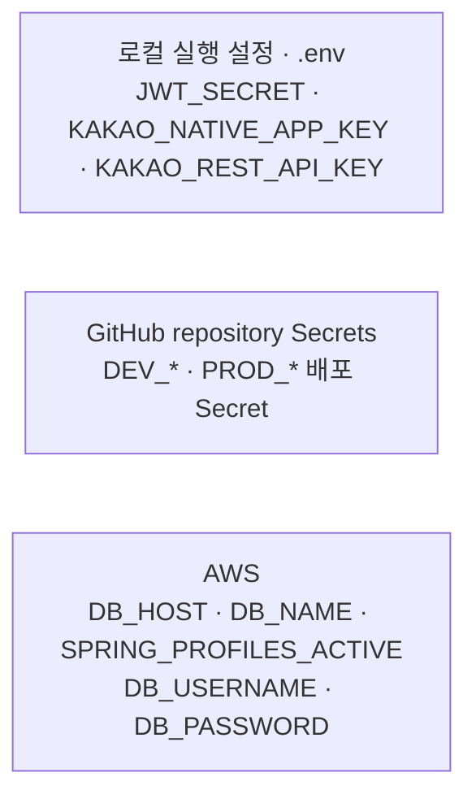

# 백엔드 CI/CD

[.github/workflows/ci.yml](../.github/workflows/ci.yml)이 코드 검증을 담당합니다. [.github/workflows/cd-dev.yml](../.github/workflows/cd-dev.yml)과 [.github/workflows/cd-prod.yml](../.github/workflows/cd-prod.yml)이 환경별 배포를 담당합니다.

## 실행 조건

- `main`, `develop` 대상 PR: CI만 실행
- `develop` push: CI 통과 후 dev 자동 배포
- `main` push: CI 실행
- `main`에서 수동 실행: CI 통과와 입력 검증 후 prod 배포
- draft PR: 실행하지 않고 draft를 해제하면 실행

prod 배포는 health check까지 성공한 dev 배포의 `dev_commit_sha`, `release_version`의 `vMAJOR.MINOR.PATCH`, `confirmation`의 `DEPLOY_PRODUCTION`을 입력해야 합니다. dev와 prod의 Git tree가 같아야 합니다.

## CI

CI는 `workflow_call`을 지원하며 dev·prod CD가 같은 검증 절차를 호출합니다.
`uses: owner/repository@ref`의 `@` 뒤에는 [브랜치·태그·commit SHA](https://docs.github.com/en/actions/reference/workflows-and-actions/workflow-syntax#jobsjob_idstepsuses)를 쓸 수 있습니다. `@v4`는 같은 major 버전의 다른 commit을 가리키도록 이동할 수 있는 태그이고, 40자리 full commit SHA는 특정 commit을 고정하는 유일한 불변 표기입니다.
외부 Action은 [GitHub 보안 권장사항](https://docs.github.com/en/actions/reference/security/secure-use)에 따라 full commit SHA로 고정하고, 사람이 버전을 알아볼 수 있도록 같은 줄의 주석에 release version을 기록합니다.

1. JDK 25와 Gradle 캐시 설정
2. Spotless 포맷 검사
3. 전체 테스트와 JaCoCo 커버리지 검증
4. JaCoCo HTML 리포트 업로드
5. PR 커버리지 코멘트 작성

라인 커버리지는 70% 이상이어야 합니다. `MeongcoachApplication`과 `shared/config`는 검증에서 제외합니다.
`shared/config`에는 설정만 두고 검증 로직은 커버리지 대상 패키지에 둡니다.

## 배포

| 구분 | dev | prod |
| --- | --- | --- |
| 브랜치 | `develop` | `main` |
| 실행 | push 자동 | 수동 |
| ECR | `meongcoach-dev-ecr` | `meongcoach-prod-ecr` |
| ECS cluster | `meongcoach-dev-cluster` | `meongcoach-prod-cluster` |
| ECS service | `meongcoach-dev-svc` | `meongcoach-prod-svc` |
| AWS role secret | `DEV_AWS_DEPLOY_ROLE_ARN` | `PROD_AWS_DEPLOY_ROLE_ARN` |

배포는 `linux/amd64` 이미지를 커밋 SHA 태그로 ECR에 올립니다. 환경별 task definition family의 최신 리비전에서 DB 설정·Secrets Manager 참조·Spring 프로파일을 보존하고, GitHub Secrets의 애플리케이션 설정과 `api` 이미지를 반영한 뒤 환경별 health endpoint를 확인합니다.

## 환경 변수 관리

다음 다이어그램은 환경 변수가 최초로 정의되는 위치를 소유자로 표시합니다. 전달되거나 사용되는 위치에는 중복해서 표시하지 않습니다.

CI 테스트는 `application-test.yml`의 테스트 전용 설정을 사용하므로 배포 환경 변수를 주입하지 않습니다. CD의 AWS 인증에는 GitHub repository secret인 `DEV_AWS_DEPLOY_ROLE_ARN` 또는 `PROD_AWS_DEPLOY_ROLE_ARN`을 사용합니다.

DB 설정은 AWS가 소유합니다. `DB_HOST`·`DB_NAME`은 ECS task definition의 `environment`에 두고, `DB_USERNAME`·`DB_PASSWORD`는 RDS 관리형 secret을 `secrets`로 참조합니다. CD는 새 task definition을 등록할 때 이 설정을 보존하므로 GitHub Actions가 DB 자격증명 값을 직접 다루지 않습니다.

Spring 프로파일은 환경별 Terraform task definition이 소유합니다. dev는 `SPRING_PROFILES_ACTIVE=dev`, prod는 `SPRING_PROFILES_ACTIVE=prod`로 고정하며 CD는 값을 변경하지 않습니다.

DB 외 애플리케이션 설정은 GitHub repository Secret이 소유하며 CD가 task definition의 `environment`에 주입합니다. dev와 prod는 다음 이름으로 서로 독립된 값을 관리합니다.

- `DEV_JWT_SECRET` / `PROD_JWT_SECRET`
- `DEV_KAKAO_NATIVE_APP_KEY` / `PROD_KAKAO_NATIVE_APP_KEY`
- `DEV_KAKAO_REST_API_KEY` / `PROD_KAKAO_REST_API_KEY`
- `DEV_R2_ENDPOINT` / `PROD_R2_ENDPOINT`
- `DEV_R2_ACCESS_KEY_ID` / `PROD_R2_ACCESS_KEY_ID`
- `DEV_R2_SECRET_ACCESS_KEY` / `PROD_R2_SECRET_ACCESS_KEY`
- `DEV_R2_BUCKET` / `PROD_R2_BUCKET`
- `DEV_R2_PUBLIC_BASE_URL` / `PROD_R2_PUBLIC_BASE_URL`
- `DEV_S3_REGION` / `PROD_S3_REGION`
- `DEV_S3_ACCESS_KEY_ID` / `PROD_S3_ACCESS_KEY_ID`
- `DEV_S3_SECRET_ACCESS_KEY` / `PROD_S3_SECRET_ACCESS_KEY`
- `DEV_S3_BUCKET` / `PROD_S3_BUCKET`
- `DEV_S3_PUBLIC_BASE_URL` / `PROD_S3_PUBLIC_BASE_URL`
- `DEV_VIMEO_ACCESS_TOKEN` / `PROD_VIMEO_ACCESS_TOKEN`

R2 Secret은 이미지, S3 Secret은 훈련 영상 업로드 URL 발급에 쓰입니다. 환경별 `S3_*` Secret은 필수값이라 등록하지 않은 상태로 CD가 실행되면 태스크 정의 생성 단계에서 배포가 중단됩니다.

환경별 `VIMEO_ACCESS_TOKEN`은 Vimeo 연동 전까지 선택값이며, 대응하는 repository Secret이 등록된 경우에만 task definition에 주입합니다.

이 값들은 ECS task definition에 평문으로 저장되며 `ecs:DescribeTaskDefinition` 권한이 있는 주체가 읽을 수 있습니다. 로컬 `.env`는 `JWT_SECRET`, `KAKAO_NATIVE_APP_KEY`, `KAKAO_REST_API_KEY`를 관리하며 저장소에 커밋하지 않습니다.

## 알림과 실패 확인

- CI는 PR 코멘트, JaCoCo artifact, Actions 로그에서 확인합니다.
- Slack 채널에서 `/github subscribe DaeSaBu/meongcoach-BE workflows:{name:"CI","CD - Dev","CD - Prod"}`로 workflow 알림을 구독합니다.
- 로컬 CI는 `./gradlew spotlessCheck test jacocoTestCoverageVerification`으로 재현합니다.
