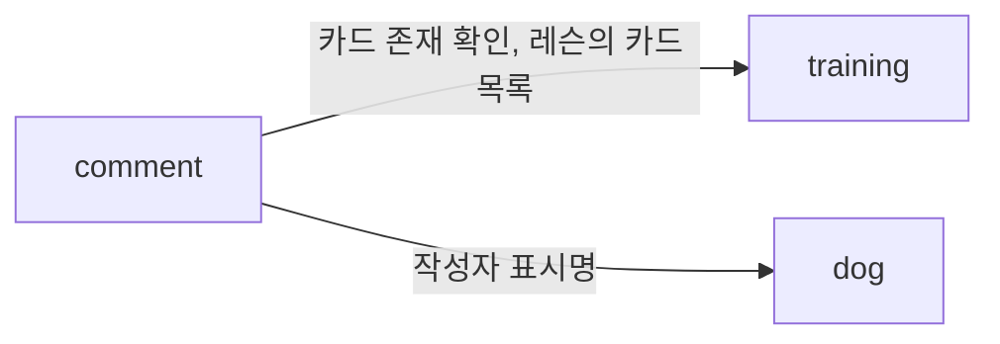
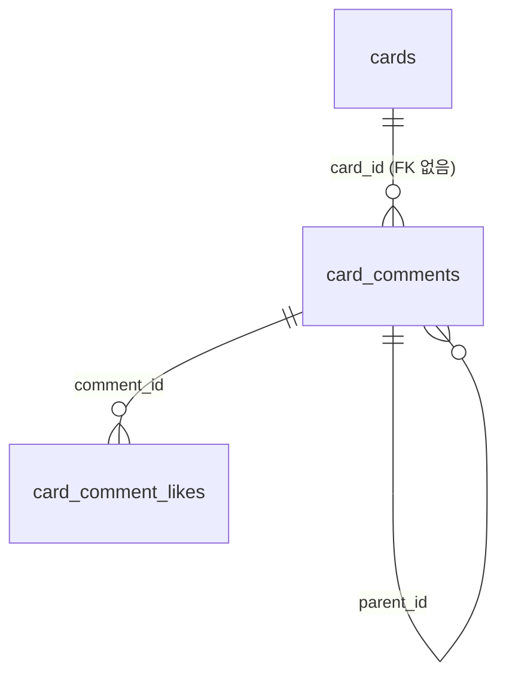

# 교육 카드 댓글 (comment 모듈)

comment 모듈은 교육 카드에 달리는 보호자 댓글·답글·좋아요를 소유합니다. 댓글은 모든 사용자가 공유하며, 답글은 한 단계까지만 허용합니다.

- 화면 설계: [멍코치 카드 댓글 기능 UI](https://claude.ai/design/p/c23bc61f-0a44-4af3-9954-5e127b535a1a?file=%EB%A9%8D%EC%BD%94%EC%B9%98+%EC%B9%B4%EB%93%9C+%EB%8C%93%EA%B8%80+%EA%B8%B0%EB%8A%A5+UI.dc.html) (DAE-464)
- 구현 이슈: DB DAE-462, API DAE-460

## 범위

| 포함 | 제외 |
|---|---|
| 카드별 댓글 목록·작성 | 댓글 삭제 (DAE-470) |
| 답글 목록·작성 (한 단계) | 댓글 수정 (DAE-471) |
| 댓글·답글 좋아요 | 댓글 신고 (DAE-472) |
| 카드별 댓글 수 | 멘션(`@이름`) 저장·알림 |
| | 작성자 프로필 화면 이동 |

답글 입력창의 `@보리 보호자`는 앱이 채우는 입력 보조입니다. 서버는 이를 일반 본문 텍스트로 저장하며 멘션 대상을 따로 기록하지 않습니다.

## 모듈 구성

comment는 새 최상위 모듈입니다. 댓글은 `training`의 카드와 생명주기·변경 주기가 달라 별도 모듈로 분리합니다.



- `training`, `dog`는 comment를 참조하지 않습니다. 카드 목록 응답(`GET /api/training/lessons/{lessonId}/cards`)에 댓글 수를 넣지 않는 이유입니다. 댓글 수는 comment 모듈의 별도 API로 조회합니다.
- 다른 모듈의 엔티티는 ID로만 참조합니다(`cardId`, `userId`).
- 접근 권한은 `USER` 역할입니다. `SecurityConfig`의 기본 규칙(`anyRequest().hasRole(USER)`)을 따르므로 별도 경로 설정이 없습니다.

### 필요한 provided 인터페이스

| 모듈 | 용도 | 비고 |
|---|---|---|
| `training` | 카드 존재 확인. 없으면 `CardNotFoundException`(404) | 신규 |
| `training` | 레슨에 속한 카드 ID 목록 | 기존 `LessonFinder.findCards` 사용 |
| `dog` | 여러 사용자의 선택된 강아지 이름을 한 번에 조회 | 신규. 목록 한 페이지의 작성자를 일괄 조회해 N+1을 막는다 |

## 작성자 표시명

작성자는 `{선택된 강아지 이름} 보호자`로 표시합니다(예: `보리 보호자`). 아바타는 공통 발바닥 아이콘이며 서버는 이미지 URL을 내려주지 않습니다.

- 표시명은 조회 시점에 `dog` 모듈에서 가져옵니다. 댓글 행에 이름을 저장하지 않습니다.
- 서버는 강아지 이름(`authorDogName`)만 내려주고, `보호자` 접미사는 앱이 붙입니다.

> **미확정:** 다음 사항은 기획 논의 후 확정합니다.
> - 작성 시점 이름을 고정할지, 강아지 선택·이름 변경을 즉시 반영할지
> - 탈퇴한 사용자나 선택된 강아지가 없는 사용자의 댓글 표시 방식

## 데이터 모델



### card_comments

| 컬럼 | 타입 | 제약 | 설명 |
|---|---|---|---|
| `id` | BIGINT | PK, IDENTITY | |
| `card_id` | BIGINT | NOT NULL | 카드 ID. 모듈 경계를 넘으므로 FK를 두지 않는다 |
| `user_id` | BIGINT | NOT NULL | 작성자 ID. FK를 두지 않는다 |
| `parent_id` | BIGINT | NULL, FK → `card_comments.id` | NULL이면 최상위 댓글, 값이 있으면 답글 |
| `content` | VARCHAR(500) | NOT NULL | 본문 |
| `created_at` | TIMESTAMP | NOT NULL | |
| `updated_at` | TIMESTAMP | NOT NULL | |

인덱스:
- `(card_id, id)` WHERE `parent_id IS NULL`: 카드별 최상위 댓글 커서 조회
- `(parent_id, id)`: 답글 커서 조회와 답글 수 집계

### card_comment_likes

| 컬럼 | 타입 | 제약 | 설명 |
|---|---|---|---|
| `comment_id` | BIGINT | PK(복합), FK → `card_comments.id` | |
| `user_id` | BIGINT | PK(복합) | 좋아요 누른 사용자 |
| `created_at` | TIMESTAMP | NOT NULL | |

복합 PK가 사용자당 좋아요 1회를 보장합니다.

### 집계 방식

좋아요 수, 답글 수, 카드별 댓글 수는 카운터 컬럼 없이 조회 시 집계합니다. 목록 한 페이지의 댓글 ID로 `GROUP BY` 쿼리를 한 번씩 실행합니다. 카운터 컬럼의 동시성 관리보다 단순하고, 현재 트래픽에서 집계 비용은 인덱스로 충분합니다.

## 도메인 규칙

- 본문은 앞뒤 공백을 제거한 뒤 1~500자여야 합니다. 위반하면 400을 반환합니다.
- 답글에 답글을 달면 서버가 원 답글의 `parent_id`(최상위 댓글)에 연결합니다. 답글 깊이는 항상 1입니다.
- 답글은 부모 댓글과 같은 `card_id`를 가집니다. 요청에서 받지 않고 부모에서 복사합니다.
- 좋아요 추가·취소는 멱등입니다. 이미 누른 상태에서 추가하거나 누르지 않은 상태에서 취소해도 성공합니다.
- 자기 댓글에도 좋아요를 누를 수 있습니다.
- 카드 댓글 수(`댓글 4`)는 최상위 댓글과 답글을 모두 셉니다.

## API

모든 API는 인증이 필요합니다. 시각은 UTC ISO-8601로 내려주며 상대 시각(`10분 전`)은 앱이 계산합니다.

| 메서드 | 경로 | 설명 | 화면 |
|---|---|---|---|
| GET | `/api/cards/{cardId}/comments` | 최상위 댓글 목록 | 01 |
| POST | `/api/cards/{cardId}/comments` | 최상위 댓글 작성 | 03 |
| GET | `/api/comments/{commentId}/replies` | 답글 목록 | 02 |
| POST | `/api/comments/{commentId}/replies` | 답글 작성 | 04 |
| PUT | `/api/comments/{commentId}/like` | 좋아요 | 01, 02 |
| DELETE | `/api/comments/{commentId}/like` | 좋아요 취소 | 01, 02 |
| GET | `/api/comments/counts?lessonId={lessonId}` | 레슨 내 카드별 댓글 수 | 05 |

### 목록 조회와 페이지네이션

커서 기반입니다. 커서는 마지막으로 받은 댓글의 `id`입니다.

| 목록 | 정렬 | 기본 `size` | 최대 `size` |
|---|---|---|---|
| 최상위 댓글 | 최신순 (`id` 내림차순) | 20 | 50 |
| 답글 | 오래된 순 (`id` 오름차순) | 20 | 50 |

`GET /api/cards/{cardId}/comments?cursor={id}&size=20`

```json
{
	"totalCount": 4,
	"comments": [
		{
			"id": 12,
			"authorDogName": "보리",
			"content": "친구를 만나기 전에 간식으로 시선을 돌리니 조금 나아졌어요.",
			"createdAt": "2026-09-25T02:10:00Z",
			"likeCount": 3,
			"likedByMe": true,
			"replyCount": 1,
			"mine": false
		}
	],
	"nextCursor": 9,
	"hasNext": true
}
```

- `totalCount`는 카드의 전체 댓글 수(답글 포함)이며 시트 헤더에 씁니다.
- `replyCount`는 `답글 N개 더 보기` 표시에 씁니다.
- `mine`은 작성자 본인 여부입니다. 삭제·수정·신고 버튼 분기에 쓰려고 미리 둡니다.

답글 목록(`GET /api/comments/{commentId}/replies`)의 항목은 `replyCount`가 없다는 점을 빼면 같은 형식입니다. `totalCount`는 없습니다.

### 작성

`POST /api/cards/{cardId}/comments`, `POST /api/comments/{commentId}/replies`

```json
{ "content": "현관에서 많이 기다리는 연습부터 해볼게요." }
```

`201 Created`로 작성된 댓글을 목록 항목과 같은 형식으로 반환합니다. 앱은 목록을 다시 조회하지 않고 이 응답을 목록에 끼워 넣습니다.

### 좋아요

`PUT`/`DELETE /api/comments/{commentId}/like`는 `200 OK`로 갱신된 상태를 반환합니다.

```json
{ "likeCount": 4, "likedByMe": true }
```

### 카드별 댓글 수

`GET /api/comments/counts?lessonId={lessonId}`는 레슨의 모든 카드 댓글 수를 한 번에 반환합니다. 앱은 레슨 진입 시 카드 목록과 함께 한 번 호출합니다. 댓글이 없는 카드는 `0`으로 포함합니다.

```json
{
	"counts": [
		{ "cardId": 101, "commentCount": 4 },
		{ "cardId": 102, "commentCount": 0 }
	]
}
```

## 에러

`CommentErrorCode`로 정의하며 응답 형식은 [error-handling.md](error-handling.md)를 따릅니다.

| 코드 | 상태 | 조건 |
|---|---|---|
| `COMMENT_NOT_FOUND` | 404 | 답글 작성·답글 조회·좋아요 대상 댓글이 없음 |
| `COMMENT_INVALID_CONTENT` | 400 | 본문이 공백뿐이거나 500자를 넘음 |
| `TRAINING_CARD_NOT_FOUND` | 404 | 카드가 없음. `training` 모듈이 던진다 |
| `TRAINING_LESSON_NOT_FOUND` | 404 | 댓글 수 조회의 레슨이 없음. 기존 `LessonNotFoundException` |
