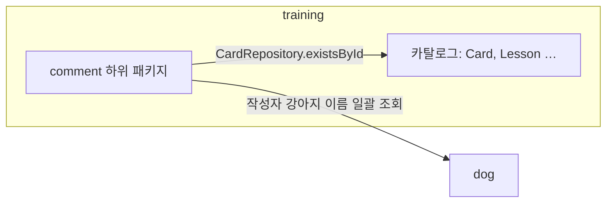
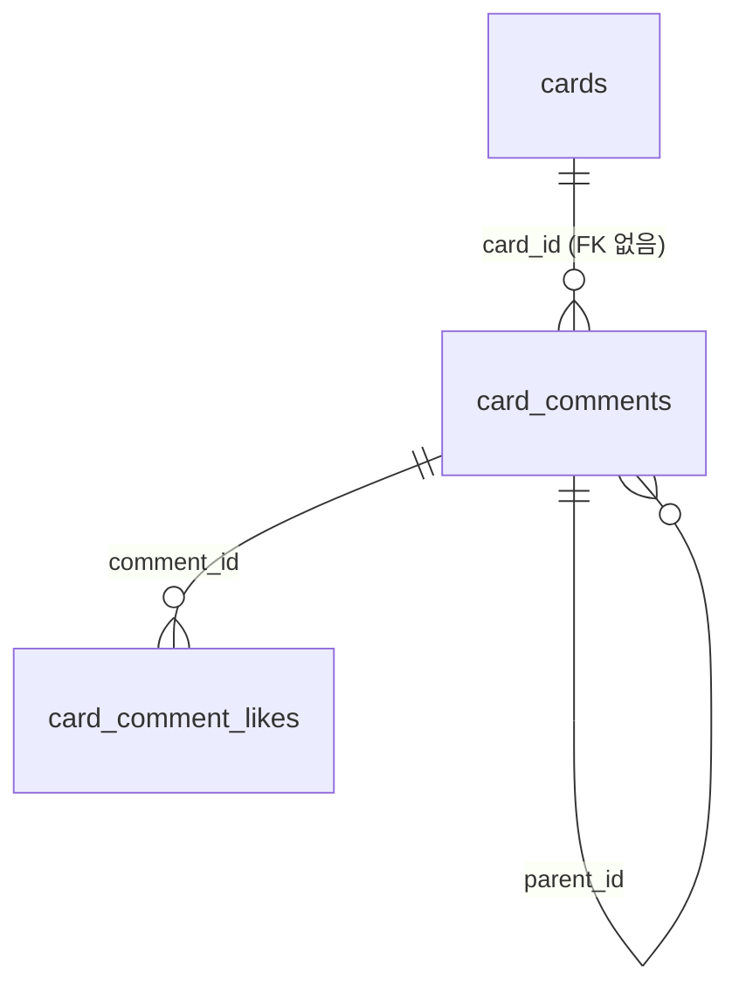

# 코멘트 기능 설계

 코멘트 기능은 보기보다 신경을 쓸 게 많은 부분이다. 현재로서는 기능이 한정되어 있어서 크게 복잡해지지는 않겠으나, 추후 복잡해질 여지가 많다.

 작업을 진행하기 전에 내가 제시할 수 있는 주요 의문은 이하와 같다.

 1. training에 귀속되는 기능인데, 이것을 training에 두는 것이 맞는가?
    1. 만일 comment로 모듈을 분리한다고 가정하면 적절한 수정일까?
 2. Card와의 연관 관계를 어떻게 설정해야 하는가? Cascade Delete를 허용해야 하는가?
 3. 알림 기능을 추가한다고 가정했을 때에 Card와 Comment의 양방향 참조가 필요하지는 않을까?
    1. 이를 Notification 계층으로 따로 나누어서 Card와 Comment가 독립적으로 하는 것이 좋지 않을까?

내가 생각하기에 진행해야하는 작업은 이하와 같다.

 1. card_comment에 대한 데이터 모델링
    1. card_comment_reply에 대한 데이터 모델링
    2. card_comment_like에 대한 데이터 모델링
 2. api 요청에 대한 설계
 3.

<!-- 이 이하는 AI가 작성한다.  -->

# 교육 카드 댓글 (training 모듈)

교육 카드에 달리는 보호자 댓글·답글·좋아요는 `training` 모듈이 소유합니다. 댓글은 모든 사용자가 공유하며, 답글은 한 단계까지만 허용합니다.

- 화면 설계: [멍코치 카드 댓글 기능 UI](https://claude.ai/design/p/c23bc61f-0a44-4af3-9954-5e127b535a1a?file=%EB%A9%8D%EC%BD%94%EC%B9%98+%EC%B9%B4%EB%93%9C+%EB%8C%93%EA%B8%80+%EA%B8%B0%EB%8A%A5+UI.dc.html) (DAE-464)
- 구현 이슈: DB DAE-462, API DAE-460

## 범위

| 포함 | 제외 |
| --- | --- |
| 카드별 댓글 목록·작성 | 댓글 삭제 (DAE-470) |
| 답글 목록·작성 (한 단계) | 댓글 수정 (DAE-471) |
| 댓글·답글 좋아요 | 댓글 신고 (DAE-472) |
| 카드별 댓글 수 | 멘션(`@이름`) 저장·알림 |
| | 작성자 프로필 화면 이동 |
| | 댓글·답글 알림 |

답글 입력창의 `@보리 보호자`는 앱이 채우는 입력 보조입니다. 서버는 이를 일반 본문 텍스트로 저장하며 멘션 대상을 따로 기록하지 않습니다.

알림을 도입할 때는 댓글 작성 이벤트를 알림 쪽이 구독하는 방식으로 붙입니다. 알림 때문에 카드와 댓글 사이에 양방향 참조를 두지 않습니다.

## 위치와 의존

카드 댓글은 "카드에 대한 보호자 대화"라는 training 컨텍스트의 개념이므로 `training` 모듈에 둡니다. 범용 `comment` 모듈은 만들지 않습니다. 산책 등 다른 영역에 댓글이 생기면 그 영역이 자기 댓글 개념을 따로 소유합니다.

모듈 안에서는 계층마다 `comment` 하위 패키지로 모읍니다.

```
training
├── domain/comment/           CardComment, CardCommentLike
├── application/comment/      CardCommentService, required/ 리포지토리
├── application/provided/     CardCommentFinder, CardCommentWriter, CardCommentLiker
└── adapter/webapi/comment/   CardCommentController, dto/
```



- 의존은 `comment → 카탈로그` 한 방향입니다. 카탈로그 쪽 코드(`Card`, `Lesson`, 카드 목록 API)는 `comment` 패키지를 참조하지 않습니다.
- `domain/comment`는 `Card`·`Lesson` 엔티티를 참조하지 않습니다. `CardComment`는 자기 애그리거트이며 `cardId`, `userId`를 값으로만 가집니다.
- 위 두 규칙은 ArchUnit 테스트로 강제합니다. 이 규칙이 지켜지는 한 댓글을 별도 모듈로 떼어내는 작업은 패키지 이동으로 끝납니다.
- 카드 존재 확인은 같은 모듈의 `CardRepository.existsById`로 합니다.
- `training → dog` 의존이 새로 생깁니다. `dog`는 `shared`만 참조하므로 순환이 없습니다.
- 접근 권한은 `USER` 역할입니다. `SecurityConfig`의 기본 규칙(`anyRequest().hasRole(USER)`)을 따르므로 별도 경로 설정이 없습니다.

`dog` 모듈에는 여러 사용자의 선택된 강아지 이름을 한 번에 조회하는 provided 인터페이스를 추가합니다. 목록 한 페이지의 작성자를 일괄 조회해 N+1을 막습니다.

## 작성자 표시명

작성자는 `{선택된 강아지 이름} 보호자`로 표시합니다(예: `보리 보호자`). 아바타는 공통 발바닥 아이콘이며 서버는 이미지 URL을 내려주지 않습니다.

- 표시명은 조회 시점에 `dog` 모듈에서 가져옵니다. 댓글 행에 이름을 저장하지 않습니다.
- 서버는 강아지 이름(`authorDogName`)만 내려주고, `보호자` 접미사는 앱이 붙입니다.

> **미확정:** 다음 사항은 기획 논의 후 확정합니다.
>
> - 작성 시점 이름을 고정할지, 강아지 선택·이름 변경을 즉시 반영할지
> - 탈퇴한 사용자나 선택된 강아지가 없는 사용자의 댓글 표시 방식

## 데이터 모델



댓글과 카드는 `cardId` 값으로만 연결합니다. JPA 연관관계와 FK를 두지 않으며, `Card` 엔티티는 댓글 컬렉션을 갖지 않습니다.

- 카드를 삭제해도 댓글은 남습니다. 카드는 초기 데이터 동기화 스크립트(`db/local/training-initial-data.sql`)의 `DELETE`로 지워지며, 이 스크립트는 댓글을 알지 못해도 됩니다.
- 댓글에서 카드를 따라가는 조회가 없으므로 남은 댓글이 카드를 찾다 실패하는 경로도 없습니다.
- 카드 하나에 붙는 댓글 수에 상한이 없으므로 `Card`가 댓글 컬렉션을 갖지 않습니다.

### card_comments

| 컬럼 | 타입 | 제약 | 설명 |
| --- | --- | --- | --- |
| `id` | BIGINT | PK, IDENTITY | |
| `card_id` | BIGINT | NOT NULL | 카드 ID. FK 없음 |
| `user_id` | BIGINT | NOT NULL | 작성자 ID. FK 없음 |
| `parent_id` | BIGINT | NULL, FK → `card_comments.id` | NULL이면 최상위 댓글, 값이 있으면 답글 |
| `content` | VARCHAR(500) | NOT NULL | 본문 |
| `created_at` | TIMESTAMP | NOT NULL | |
| `updated_at` | TIMESTAMP | NOT NULL | |

인덱스:

- `(card_id, id)`: 카드별 최상위 댓글 커서 조회와 카드 댓글 수 집계
- `(parent_id, id)`: 답글 커서 조회와 답글 수 집계

### card_comment_likes

| 컬럼 | 타입 | 제약 | 설명 |
| --- | --- | --- | --- |
| `comment_id` | BIGINT | PK(복합), FK → `card_comments.id` | |
| `user_id` | BIGINT | PK(복합) | 좋아요 누른 사용자. FK 없음 |
| `created_at` | TIMESTAMP | NOT NULL | |

복합 PK가 사용자당 좋아요 1회를 보장합니다.

### 집계 방식

카드 댓글 수, 답글 수, 좋아요 수는 카운터 컬럼 없이 조회할 때마다 셉니다. 목록 요청 한 번에 카드 댓글 수는 `COUNT`, 답글 수와 좋아요 수는 페이지의 댓글 ID로 `GROUP BY`를 한 번씩 실행합니다. 모든 집계가 위 인덱스와 PK를 타며 스캔 범위는 카드 하나의 댓글 수입니다.

카운터 컬럼은 쓰기마다 부모 행 갱신, 락 경합, 멱등성 처리, 값 어긋남 복구가 따라오므로 두지 않습니다.

## 도메인 규칙

- 본문은 앞뒤 공백을 제거한 뒤 1~500자여야 합니다. 위반하면 400을 반환합니다.
- 답글에 답글을 달면 서버가 원 답글의 `parent_id`(최상위 댓글)에 연결합니다. 답글 깊이는 항상 1입니다.
- 답글은 부모 댓글과 같은 `card_id`를 가집니다. 요청에서 받지 않고 부모에서 복사합니다.
- 좋아요 추가·취소는 멱등입니다. 이미 누른 상태에서 추가하거나 누르지 않은 상태에서 취소해도 성공합니다.
- 자기 댓글에도 좋아요를 누를 수 있습니다.
- 카드 댓글 수(`댓글 4`)는 최상위 댓글과 답글을 모두 셉니다.

## API

경로는 기존 `training` API(`/api/training/lessons/…`)와 같은 접두사를 씁니다. 모든 API는 인증이 필요합니다. 시각은 UTC ISO-8601로 내려주며 상대 시각(`10분 전`)은 앱이 계산합니다.

| 메서드 | 경로 | 설명 | 화면 |
| --- | --- | --- | --- |
| GET | `/api/training/cards/{cardId}/comments` | 최상위 댓글 목록과 카드 댓글 수 | 01, 05 |
| POST | `/api/training/cards/{cardId}/comments` | 최상위 댓글 작성 | 03 |
| GET | `/api/training/comments/{commentId}/replies` | 답글 목록 | 02 |
| POST | `/api/training/comments/{commentId}/replies` | 답글 작성 | 04 |
| PUT | `/api/training/comments/{commentId}/like` | 좋아요 | 01, 02 |
| DELETE | `/api/training/comments/{commentId}/like` | 좋아요 취소 | 01, 02 |

카드 화면의 댓글 수 배지(05)는 목록 응답의 `totalCount`로 그립니다. 앱은 카드가 화면에 보일 때 목록을 미리 불러오고, 시트를 열 때 같은 데이터를 씁니다. 카드 목록 API(`GET /api/training/lessons/{lessonId}/cards`)의 응답에는 댓글 수를 넣지 않습니다.

### 목록 조회와 페이지네이션

커서 기반입니다. 커서는 마지막으로 받은 댓글의 `id`입니다.

| 목록 | 정렬 | 기본 `size` | 최대 `size` |
| --- | --- | --- | --- |
| 최상위 댓글 | 최신순 (`id` 내림차순) | 20 | 50 |
| 답글 | 오래된 순 (`id` 오름차순) | 20 | 50 |

`GET /api/training/cards/{cardId}/comments?cursor={id}&size=20`

```json
{
	"totalCount": 4,
	"comments": [
		{
			"id": 12,
			"authorDogName": "보리",
			"content": "친구를 만나기 전에 간식으로 시선을 돌리니 조금 나아졌어요.",
			"createdAt": "2026-09-25T02:10:00Z",
			"likeCount": 3,
			"likedByMe": true,
			"replyCount": 1,
			"mine": false
		}
	],
	"nextCursor": 9,
	"hasNext": true
}
```

- `totalCount`는 카드의 전체 댓글 수(답글 포함)이며 시트 헤더와 카드 화면 배지에 씁니다.
- `replyCount`는 `답글 N개 더 보기` 표시에 씁니다.
- `mine`은 작성자 본인 여부입니다. 삭제·수정·신고 버튼 분기에 쓰려고 미리 둡니다.

답글 목록(`GET /api/training/comments/{commentId}/replies`)의 항목은 `replyCount`가 없다는 점을 빼면 같은 형식입니다. `totalCount`는 없습니다.

### 작성

`POST /api/training/cards/{cardId}/comments`, `POST /api/training/comments/{commentId}/replies`

```json
{ "content": "현관에서 많이 기다리는 연습부터 해볼게요." }
```

`201 Created`로 작성된 댓글을 목록 항목과 같은 형식으로 반환합니다. 앱은 목록을 다시 조회하지 않고 이 응답을 목록에 끼워 넣습니다.

### 좋아요

`PUT`/`DELETE /api/training/comments/{commentId}/like`는 `200 OK`로 갱신된 상태를 반환합니다.

```json
{ "likeCount": 4, "likedByMe": true }
```

## 에러

`TrainingErrorCode`에 추가하며 응답 형식은 [error-handling.md](error-handling.md)를 따릅니다.

| 코드 | 상태 | 조건 |
| --- | --- | --- |
| `TRAINING_CARD_NOT_FOUND` | 404 | 댓글을 달 카드가 없음 |
| `TRAINING_COMMENT_NOT_FOUND` | 404 | 답글 작성·답글 조회·좋아요 대상 댓글이 없음 |
| `TRAINING_COMMENT_INVALID_CONTENT` | 400 | 본문이 공백뿐이거나 500자를 넘음 |
