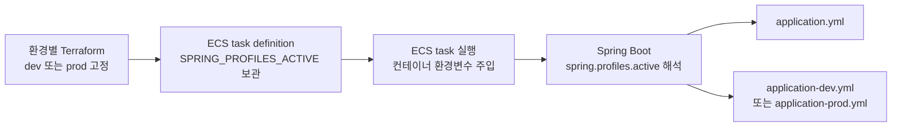

# 프로파일 구성

환경별 설정은 Spring 프로파일로 분리합니다. 공통 값(JWT·소셜 로그인 설정, HTTP 타임아웃 등)은
`application.yml`에 두고, 환경별로 달라지는 값(DB, ddl-auto, 초기 데이터)만 프로파일 파일에 둡니다.

## 프로파일 표

| 프로파일 | DB | ddl-auto | 용도 | 필요 환경 변수 |
|---|---|---|---|---|
| `local` | PostgreSQL 18.3 | `create-drop` | 로컬 개발. 스키마와 교육 초기 데이터 재생성 | `JWT_SECRET`, `KAKAO_NATIVE_APP_KEY`, `KAKAO_REST_API_KEY`, `APPLE_BUNDLE_ID`, `GOOGLE_WEB_CLIENT_ID`, `GOOGLE_IOS_CLIENT_ID` |
| `dev` | PostgreSQL | `validate` | 개발 서버 | `JWT_SECRET`, `KAKAO_NATIVE_APP_KEY`, `KAKAO_REST_API_KEY`, `APPLE_BUNDLE_ID`, `GOOGLE_WEB_CLIENT_ID`, `GOOGLE_IOS_CLIENT_ID`, `DB_HOST`, `DB_NAME`, `DB_USERNAME`, `DB_PASSWORD`, `SENTRY_DSN`(선택) |
| `prod` | PostgreSQL | `validate` | 운영 | `JWT_SECRET`, `KAKAO_NATIVE_APP_KEY`, `KAKAO_REST_API_KEY`, `APPLE_BUNDLE_ID`, `GOOGLE_WEB_CLIENT_ID`, `GOOGLE_IOS_CLIENT_ID`, `DB_HOST`, `DB_NAME`, `DB_USERNAME`, `DB_PASSWORD`, `SENTRY_DSN`(선택) |
| `test` | H2 (인메모리) | `create-drop` | 테스트. `build.gradle.kts`가 강제 활성화 | 없음 (더미 값 내장) |

- `DB_HOST`와 `DB_NAME`으로 `jdbc:postgresql://{host}:5432/{database}` URL을 구성합니다.
- local DB 설정에는 로컬 전용 기본값이 있고, dev/prod 환경 변수에는 기본값이 없습니다. `SENTRY_DSN`만 예외로, 없으면 Sentry SDK가 꺼진 채 기동합니다 ([error-handling.md](error-handling.md) "Sentry 전송").

## 활성화 방법

- **로컬**: `./gradlew bootRun`(또는 IDE Run)만 실행하면 됩니다. `spring-boot-docker-compose`
  의존성(`developmentOnly` — 배포 jar에는 포함되지 않음)이 `compose.yml`의 postgres를 자동으로
  기동하고 접속 정보를 주입하며, 애플리케이션을 종료하면 컨테이너도 함께 정지합니다. 교육 초기 데이터는
  `src/main/resources/db/local/training-initial-data.sql`에서, 스토어 심사용 테스트 계정은
  `db/local/test-account-data.sql`에서 자동으로 적재됩니다. (계정 정보는 파일 머리 주석, 등록 방법은 [security.md](security.md) 참고)
  애플리케이션을 기동할 때마다 스키마를 재생성합니다. PostgreSQL 데이터는 `tmpfs`에 저장되어
  컨테이너를 중지하거나 재시작하면 초기화됩니다.
  백엔드까지 컨테이너로 실행할 때는 `.env`를 준비하고
  `docker compose --profile app up --build`를 사용합니다. 이 모드에서는 compose 지원이 없으므로
  `compose.yml`이 주입하는 `DB_HOST` 환경 변수로 접속합니다.
  compose 자동 기동은 local 전용입니다 — dev/prod 프로파일은 `spring.docker.compose.enabled: false`로
  꺼 두어, 로컬에서 dev/prod 프로파일로 실행해도 로컬 postgres가 접속 정보를 덮어쓰지 않습니다.
- **배포**: 환경별 Terraform task definition이 `SPRING_PROFILES_ACTIVE=dev` 또는 `prod`를 고정합니다. CD는 이 값과 DB 설정을 보존하고 GitHub Secrets의 애플리케이션 설정과 이미지를 반영합니다.
- **테스트**: `build.gradle.kts`의 `tasks.withType<Test>`가 `spring.profiles.active=test`를
  강제하므로 별도 설정이 필요 없습니다.

### 배포 프로파일 전달 흐름

CD는 환경별 task definition family의 최신 리비전에서 프로파일을 보존하고 이미지와 GitHub Secrets의 애플리케이션 설정만 반영합니다. Spring Boot는 `SPRING_PROFILES_ACTIVE`를 `spring.profiles.active`로 해석하고 `application.yml`과 환경별 프로파일 파일을 함께 읽습니다.

> 트러블슈팅: 셸에 `SPRING_PROFILES_ACTIVE`가 남아 있으면 `profiles.default`가 무시됩니다.
> 프로파일이 이상하게 잡히면 `echo $SPRING_PROFILES_ACTIVE`부터 확인하세요.

## API 문서 노출 (`meongcoach.api-docs.enabled`)

Swagger UI는 API 서버가 정적 파일로 직접 서빙하며, 노출 범위를 프로파일별 플래그로 통제합니다.
`develop`에 merge되어 dev 배포가 성공하면 https://api.dev.meongcoach.com/swagger-ui/index.html 이 자동 갱신됩니다.
([api-docs.md](api-docs.md) 참고)

| 프로파일 | 값 | `/swagger-ui/**` 동작 |
|---|---|---|
| `local`, `dev` | `true` | 인증 없이 접근 가능 (permitAll) |
| `prod` | `false` (명시) | 완전 차단 (denyAll — 유효 토큰으로도 접근 불가) |
| `test` 등 미설정 | `false` (기본값) | 완전 차단 |
