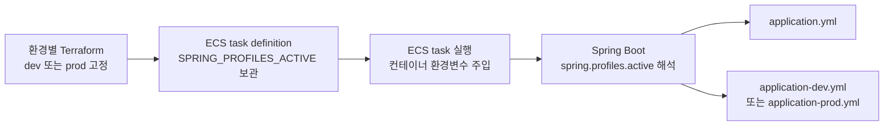

# 프로파일 구성

환경별 설정은 Spring 프로파일로 분리합니다. 공통 값(JWT·카카오 설정, HTTP 타임아웃 등)은
`application.yml`에 두고, 환경별로 달라지는 값(DB, ddl-auto, h2-console)만 프로파일 파일에 둡니다.

## 프로파일 표

| 프로파일 | DB | ddl-auto | 용도 | 필요 환경 변수 |
|---|---|---|---|---|
| `local` | H2 (인메모리) | `create-drop` | 로컬 개발. h2-console 사용 가능 | `JWT_SECRET`, `KAKAO_AUDIENCES` |
| `dev` | PostgreSQL | `update` | 개발 서버 | `JWT_SECRET`, `KAKAO_AUDIENCES`, `DB_HOST`, `DB_NAME`, `DB_USERNAME`, `DB_PASSWORD` |
| `prod` | PostgreSQL | `validate` | 운영 | `JWT_SECRET`, `KAKAO_AUDIENCES`, `DB_HOST`, `DB_NAME`, `DB_USERNAME`, `DB_PASSWORD` |
| `test` | H2 (인메모리) | `create-drop` | 테스트. `build.gradle.kts`가 강제 활성화 | 없음 (더미 값 내장) |

- `DB_HOST`와 `DB_NAME`으로 `jdbc:postgresql://{host}:5432/{database}` URL을 구성합니다.
- 모든 환경 변수는 기본값이 없어 **미주입 시 기동에 실패합니다.** 커밋된 값이 배포로 흘러가는 것을 막기 위함입니다.

## 활성화 방법

- **로컬**: 아무것도 지정하지 않으면 됩니다. `spring.profiles.default: local`이라
  `./gradlew bootRun`만으로 local로 기동합니다.
- **배포**: 환경별 Terraform task definition이 `SPRING_PROFILES_ACTIVE=dev` 또는 `prod`를 고정합니다. CD는 환경변수와 Secrets Manager 참조를 유지하고 이미지만 교체합니다.
- **테스트**: `build.gradle.kts`의 `tasks.withType<Test>`가 `spring.profiles.active=test`를
  강제하므로 별도 설정이 필요 없습니다.

### 배포 프로파일 전달 흐름

1. dev Terraform task definition은 `dev`, prod Terraform task definition은 `prod`를 `SPRING_PROFILES_ACTIVE`에 고정합니다.
2. CD는 환경별 task definition family의 최신 리비전에서 환경변수를 보존하고 이미지 URI만 교체해 새 리비전을 등록합니다.
3. ECS는 새 task를 시작할 때 task definition의 값을 컨테이너 환경변수로 주입합니다.
4. Spring Boot는 `SPRING_PROFILES_ACTIVE`를 `spring.profiles.active`로 해석합니다.
5. Spring Boot는 `application.yml`을 읽고 활성 프로파일에 맞는 `application-dev.yml` 또는 `application-prod.yml`을 추가로 읽습니다.

렌더링 스크립트는 Spring 프로파일을 다루지 않습니다. 프로파일은 환경별 인프라에 고정되고 Spring Boot가 컨테이너 환경변수에서 읽습니다.

> 트러블슈팅: 셸에 `SPRING_PROFILES_ACTIVE`가 남아 있으면 `profiles.default`가 무시됩니다.
> 프로파일이 이상하게 잡히면 `echo $SPRING_PROFILES_ACTIVE`부터 확인하세요.

## h2-console은 local 전용

h2-console은 `application-local.yml`에서만 활성화되고, 시큐리티도 `SecurityConfig`의
`@Profile("local")` 전용 체인에서만 열립니다. local 외 프로파일에서는 콘솔이 등록되지 않으며
경로 접근도 401입니다. 자세한 내용은 [security.md](security.md)의 필터 체인 구성을 참고하세요.

## ddl-auto 정책과 마이그레이션

| 프로파일 | 값 | 함의 |
|---|---|---|
| `local`/`test` | `create-drop` | 기동마다 스키마 재생성. 인메모리라 문제 없음 |
| `dev` | `update` | 엔티티 변경을 자동 반영. **컬럼 삭제·이름 변경·타입 축소는 반영되지 않아** 드리프트가 쌓일 수 있음 — dev DB는 언제든 재생성 가능하다는 전제로 운용 |
| `prod` | `validate` | 스키마를 자동 변경하지 않음. 엔티티와 불일치하면 기동 실패 |

**마이그레이션 도구(Flyway 등)가 아직 없습니다.** 따라서:

- 최초 prod 배포 전에는 스키마를 수동으로 1회 생성해야 합니다. (dev의 `update` 결과 DDL을 export하는 방법 등)
- 이후 엔티티 변경 시에도 prod 스키마 반영은 수동입니다.
- 스키마 변경이 잦아지면 Flyway 도입을 권장합니다. 도입 시 dev도 `validate`로 전환합니다.
