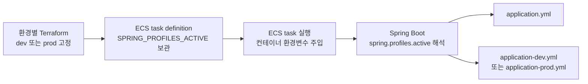

# 프로파일 구성

환경별 설정은 Spring 프로파일로 분리합니다. 공통 값(JWT·소셜 로그인 설정, HTTP 타임아웃 등)은
`application.yml`에 두고, 환경별로 달라지는 값(DB, ddl-auto, 초기 데이터)만 프로파일 파일에 둡니다.

## 프로파일 표

| 프로파일 | DB | ddl-auto | 용도 | 필요 환경 변수 |
|---|---|---|---|---|
| `local` | dev PostgreSQL (bastion 터널) | `validate` | 로컬 실행. dev DB에 접속하며 스키마를 변경하지 않음 | `JWT_SECRET`, `KAKAO_NATIVE_APP_KEY`, `KAKAO_REST_API_KEY`, `APPLE_BUNDLE_ID`, `APPLE_TEAM_ID`, `APPLE_KEY_ID`, `APPLE_PRIVATE_KEY`, `GOOGLE_WEB_CLIENT_ID`, `GOOGLE_IOS_CLIENT_ID`, `DB_HOST`, `DB_NAME`, `DB_USERNAME`, `DB_PASSWORD` |
| `dev` | PostgreSQL | `validate` | 개발 서버 | `JWT_SECRET`, `KAKAO_NATIVE_APP_KEY`, `KAKAO_REST_API_KEY`, `APPLE_BUNDLE_ID`, `APPLE_TEAM_ID`, `APPLE_KEY_ID`, `APPLE_PRIVATE_KEY`, `GOOGLE_WEB_CLIENT_ID`, `GOOGLE_IOS_CLIENT_ID`, `DB_HOST`, `DB_NAME`, `DB_USERNAME`, `DB_PASSWORD`, `SENTRY_DSN`(선택), `APP_MINIMUM_VERSION_IOS`·`APP_MINIMUM_VERSION_ANDROID`(선택) |
| `prod` | PostgreSQL | `validate` | 운영 | `JWT_SECRET`, `KAKAO_NATIVE_APP_KEY`, `KAKAO_REST_API_KEY`, `APPLE_BUNDLE_ID`, `APPLE_TEAM_ID`, `APPLE_KEY_ID`, `APPLE_PRIVATE_KEY`, `GOOGLE_WEB_CLIENT_ID`, `GOOGLE_IOS_CLIENT_ID`, `DB_HOST`, `DB_NAME`, `DB_USERNAME`, `DB_PASSWORD`, `SENTRY_DSN`(선택), `APP_MINIMUM_VERSION_IOS`·`APP_MINIMUM_VERSION_ANDROID`(선택) |
| `test` | PostgreSQL 18.3 (Testcontainers) | `create-drop` | 테스트. `build.gradle.kts`가 강제 활성화 | 없음 (더미 값 내장, Docker 데몬 필요) |

- `DB_HOST`와 `DB_NAME`으로 `jdbc:postgresql://{host}:5432/{database}` URL을 구성합니다.
- DB 접속 환경 변수에는 기본값이 없습니다. `SENTRY_DSN`만 예외로, 없으면 Sentry SDK가 꺼진 채 기동합니다 ([error-handling.md](error-handling.md) "Sentry 전송").
- `APP_MINIMUM_VERSION_IOS`·`APP_MINIMUM_VERSION_ANDROID`는 플랫폼별 최소 지원 앱 버전이며, 없으면 `application.yml`의 기본값을 씁니다 ([security.md](security.md) "필터 체인 구성").
  배포 값은 다른 애플리케이션 설정과 같이 GitHub Secrets(`DEV_APP_MINIMUM_VERSION_IOS`·`DEV_APP_MINIMUM_VERSION_ANDROID`, `PROD_`도 같은 이름)에 둡니다.
  CD가 배포할 때 값을 주입하며, Secret이 없으면 주입을 생략해 기본값이 적용됩니다. task definition에 직접 넣은 값은 다음 배포에서 지워집니다.

## 활성화 방법

- **로컬**: 로컬 전용 DB는 두지 않습니다. bastion 호스트로 dev DB에 SSH 터널을 연 뒤 `DB_*`를 터널 주소로 설정하고
  `./gradlew bootRun`(또는 IDE Run)으로 실행합니다. dev 서버와 같은 DB를 쓰므로 `ddl-auto: validate`로 스키마를 바꾸지 않고,
  마이그레이션은 dev 배포가 적용하므로 Flyway를 끕니다. 아직 dev에 적용되지 않은 마이그레이션이 필요한 엔티티 변경은
  validate에서 기동이 실패합니다.
- **배포**: 환경별 Terraform task definition이 `SPRING_PROFILES_ACTIVE=dev` 또는 `prod`를 고정합니다. CD는 이 값과 DB 설정을 보존하고 GitHub Secrets의 애플리케이션 설정과 이미지를 반영합니다.
- **테스트**: `build.gradle.kts`의 `tasks.withType<Test>`가 `spring.profiles.active=test`를
  강제하므로 별도 설정이 필요 없습니다. DB는 `application-test.yml`의 `jdbc:tc:` URL을 Testcontainers JDBC
  드라이버가 해석해 배포 환경과 같은 PostgreSQL 18.3 컨테이너를 띄우므로 Docker 데몬이 실행 중이어야 합니다.
  테스트 JVM 하나가 컨테이너 하나를 공유하고 JVM이 끝나면 정리됩니다. `bootJar`도 API 스펙 생성을 위해 `test`를
  거치므로 jar 빌드에도 Docker가 필요합니다. 그래서 이미지 빌드(Dockerfile) 안에서는 jar를 만들지 않고, CI가 만든
  jar를 CD가 artifact로 내려받아 복사만 합니다.

### 배포 프로파일 전달 흐름

```mermaid
flowchart LR
    Terraform["환경별 Terraform<br/>dev 또는 prod 고정"]
    TaskDefinition["ECS task definition<br/>SPRING_PROFILES_ACTIVE 보관"]
    ECS["ECS task 실행<br/>컨테이너 환경변수 주입"]
    Spring["Spring Boot<br/>spring.profiles.active 해석"]
    Common["application.yml"]
    Profile["application-dev.yml<br/>또는 application-prod.yml"]

    Terraform --> TaskDefinition --> ECS --> Spring
    Spring --> Common
    Spring --> Profile
```

CD는 환경별 task definition family의 최신 리비전에서 프로파일을 보존하고 이미지와 GitHub Secrets의 애플리케이션 설정만 반영합니다. Spring Boot는 `SPRING_PROFILES_ACTIVE`를 `spring.profiles.active`로 해석하고 `application.yml`과 환경별 프로파일 파일을 함께 읽습니다.

> 트러블슈팅: 셸에 `SPRING_PROFILES_ACTIVE`가 남아 있으면 `profiles.default`가 무시됩니다.
> 프로파일이 이상하게 잡히면 `echo $SPRING_PROFILES_ACTIVE`부터 확인하세요.

## API 문서 노출 (`meongcoach.api-docs.enabled`)

Swagger UI는 API 서버가 정적 파일로 직접 서빙하며, 노출 범위를 프로파일별 플래그로 통제합니다.
`develop`에 merge되어 dev 배포가 성공하면 https://api.dev.meongcoach.com/swagger-ui/index.html 이 자동 갱신됩니다.
([api-docs.md](api-docs.md) 참고)

| 프로파일 | 값 | `/swagger-ui/**` 동작 |
|---|---|---|
| `local`, `dev` | `true` | 인증 없이 접근 가능 (permitAll) |
| `prod` | `false` (명시) | 완전 차단 (denyAll — 유효 토큰으로도 접근 불가) |
| `test` 등 미설정 | `false` (기본값) | 완전 차단 |
